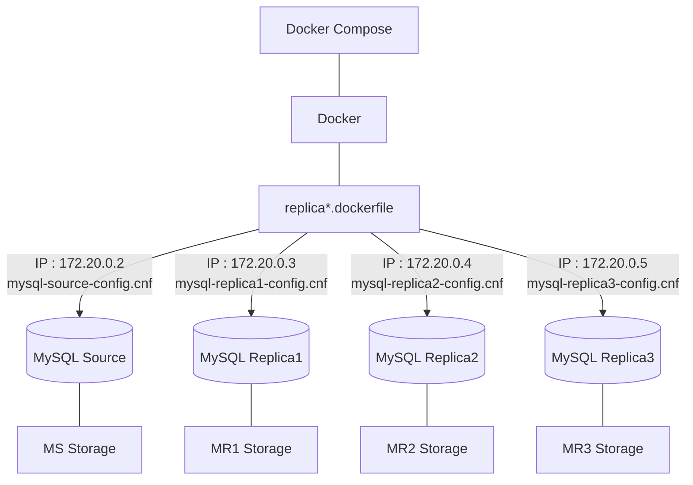
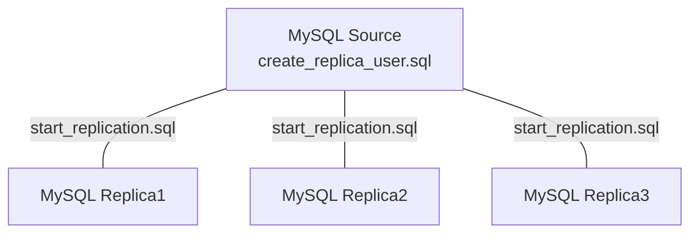

# MySQL 구축


Source와 Replica의 초기 설정을 다르게 하기 위해 cnf 파일을 다르게 생성해 dockerfile를 통해 conf.d 파일로 복사.

## source.dockerfile
```
# source.dockerfile

FROM mysql:8.0.31
COPY ./configfile/mysql-source-config.cnf /etc/mysql/conf.d
RUN chmod 777 /var/lib/mysql
RUN chmod 777 /var/lib/mysql-files
```

## replica.dockerfile

```
# replica.dockerfile

FROM mysql:8.0.31
COPY ./configfile/mysql-replica1-config.cnf /etc/mysql/conf.d
RUN chmod 777 /var/lib/mysql
RUN chmod 777 /var/lib/mysql-files
```

## mysql-source-config
```
# mysql-source-config.cnf

[mysqld]
server_id=1
gtid_mode=ON
enforce_gtid_consistency=ON
```

## mysql-replica-config
```
# mysql-replica-config.cnf

[mysqld]
server_id=2
gtid_mode=ON
enforce_gtid_consistency=ON
relay_log_purge=ON
read_only
log_slave_updates
```

# Replica 구축


Replica가 접근할 수 있도록 `create_replica_user.sql`을 통해 유저를 생성해 주고, 각각의 Replica에서 `start_replication.sql`을 통해 복제를 시작해 준다.

## create_replica_user.sql
```mysql
# create_replica_user.sql

CREATE USER 'repl_user'@'172.20.0.3' IDENTIFIED BY 'password';
GRANT REPLICATION SLAVE ON *.* TO 'repl_user'@'172.20.0.3';
CREATE USER 'repl_user'@'172.20.0.4' IDENTIFIED BY 'password';
GRANT REPLICATION SLAVE ON *.* TO 'repl_user'@'172.20.0.4';
CREATE USER 'repl_user'@'172.20.0.5' IDENTIFIED BY 'password';
GRANT REPLICATION SLAVE ON *.* TO 'repl_user'@'172.20.0.5';
```

## start_replication.sql
```mysql
CHANGE REPLICATION SOURCE TO SOURCE_HOST='172.20.0.2', SOURCE_PORT=3306, SOURCE_USER='repl_user', SOURCE_PASSWORD='password', SOURCE_AUTO_POSITION=1, GET_SOURCE_PUBLIC_KEY=1;
START REPLICA;
```

## 복제 상태 확인
```
mysql> start replica;
Query OK, 0 rows affected (0.02 sec)

mysql> show slave status \G;
*************************** 1. row ***************************   
               Slave_IO_State: Waiting for source to send event  
                  Master_Host: 172.20.0.2
                  Master_User: repl_user
                  Master_Port: 3306
                Connect_Retry: 60
              Master_Log_File: binlog.000007
          Read_Master_Log_Pos: 1923
               Relay_Log_File: a94ed59032ec-relay-bin.000008     
                Relay_Log_Pos: 2133
        Relay_Master_Log_File: binlog.000007
             Slave_IO_Running: Yes
            Slave_SQL_Running: Yes
```

