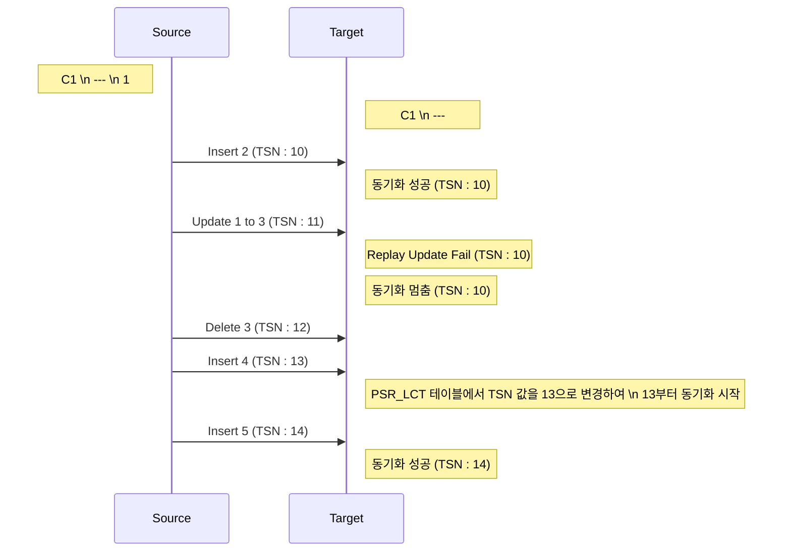

```mermaid
sequenceDiagram
	participant Source
	participant Target
	Note left of Source : C1 \n --- \n 1
	Note right of Target : C1 \n ---
	Source ->> Target : Insert 2 (TSN : 10)
	Note right of Target : 동기화 성공 (TSN : 10)
	Source ->> Target : Update 1 to 3 (TSN : 11)
	Note right of Target : Replay Update Fail (TSN : 10)
	Note right of Target : 동기화 멈춤 (TSN : 10)
	Source ->> Target : Delete 3 (TSN : 12)
	Source ->> Target : Insert 4 (TSN : 13)
	Note right of Target : PSR_LCT 테이블에서 TSN 값을 13으로 변경하여 \n 13부터 동기화 시작
	Source ->> Target : Insert 5 (TSN : 14)
	Note right of Target : 동기화 성공 (TSN : 14)
```
